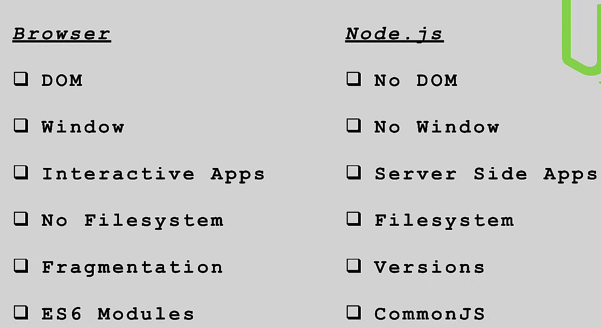

Monday, September 30, 2024

## **node.js**: environment to run JS outside browser

---



---

```bash
node
node server

```

---

- browser.js and node.js
- // sync events work step by step and it doesn't go to next step until the current step is completed
  // async events don't wait to go next step

---

REPL: Read, Eval, Print, Loop

```bash
node
```

---

## package.json

```bash

npm i nodemon -D
```

or

```bash

npm i nodemon --save-dev
```

- **npm init** command initializes **package.json** file
- **npm init -y** command sets everything to default while initialization
- devDepency is used only for the dependecies while developing the app
- 1.0.0 => major changes . minor changes . bug fixes
